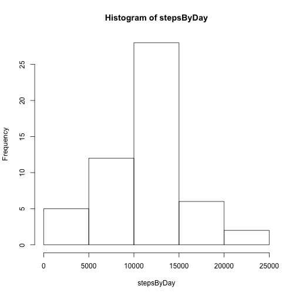
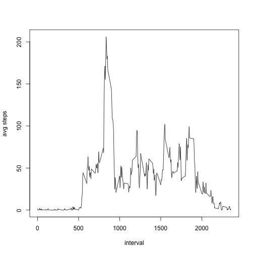
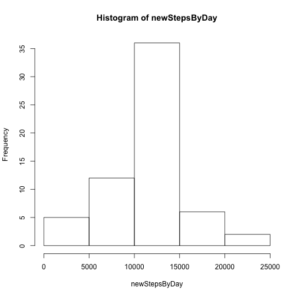
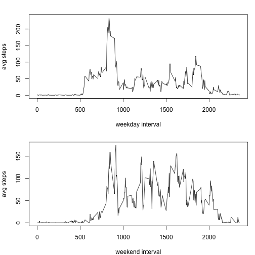

## Introduction

This assignment uses anonymous personal activity monitoring data taken from October 2012 to November 2012. The data are the number of steps taken in 5-minute intervals each day.

## Loading and preprocessing the data
Below is the code used to load and transform the data. The transformation involves changing the date field (read in as text) into a date format.


```r
activity <- read.csv("activity.csv")
activity$NewDate <- as.Date(activity$date, "%Y-%m-%d")
```

## Histogram and Mean of Steps Taken Per Day
The code below will calculate the total number of steps taken per day, draw a histogram of daily steps, and calculate the mean and median. Note that:

* the histogram is skewed to the left

* the mean (10,766.19) and the median (10,765) are close to each other


```r
stepsByDay <- tapply(activity$steps, activity$NewDate, sum)
hist(stepsByDay)
```



```r
mean(stepsByDay, na.rm=TRUE)
```

```
## [1] 10766.19
```

```r
median(stepsByDay, na.rm=TRUE)
```

```
## [1] 10765
```

## Average Daily Activity Pattern
This average daily activity pattern graph shows that the most steps are taken near 8:35am.


```r
avgStepsByInterval <- tapply(activity$steps, activity$interval, mean, na.rm=TRUE)
plot(unlist(dimnames(avgStepsByInterval)),avgStepsByInterval, type="l", xlab="interval", ylab="avg steps")
```



```r
names(which.max(avgStepsByInterval))
```

```
## [1] "835"
```

## Imputing Missing Values
Looking at the data, I found 2,304 observations of NA for steps taken in the five-minute interval. For imputing these values, I replaced the NA entry with the average of the steps for that time interval.

Upon making that change, I found that:

* both the mean and median values for the toal number of steps are 10,766.19

* the mean was consistent with that found earlier, but the median changed from 10,765 to 10,766.19

* the impact of imputing values using this strategy was to shift the median closer to the mean.


```r
sum(is.na(activity$steps))
```

```
## [1] 2304
```

```r
newActivity <- activity
for (i in 1:length(activity$steps)) {
  if (is.na(activity$steps[i])) {
    namedIndex <- as.character(activity$interval[i])
    newActivity$steps[i] <- unname(avgStepsByInterval[namedIndex])
  } else {
    newActivity$steps[i] <- activity$steps[i]
  }
}
newStepsByDay <- tapply(newActivity$steps, newActivity$NewDate, sum)
hist(newStepsByDay)
```



```r
mean(newStepsByDay, na.rm=TRUE)
```

```
## [1] 10766.19
```

```r
median(newStepsByDay, na.rm=TRUE)
```

```
## [1] 10766.19
```

## Weekday vs Weekend Differences
Finally, I explored the difference in steps per five minute interval between weekdays and weekends. By looking at the two plot below, I can visually see that weekend days have more steps throughout the afternoon, whereas weekdays tend to have the most steps around 8:30am and then settle down throughout the rest of the day.


```r
dayEnd <- 'weekday'
for (i in 1:length(activity$NewDate)) {
  if (weekdays(activity$NewDate[i]) == 'Saturday' | weekdays(activity$NewDate[i]) == 'Sunday')
    dayEnd[i] <- 'weekend'
  else
    dayEnd[i] <- 'weekday'
}
weekdayActivity <- subset(activity, dayEnd == 'weekday')
weekendActivity <- subset(activity, dayEnd == 'weekend')
avgWeekdayStepsByInterval <- tapply(weekdayActivity$steps, weekdayActivity$interval, mean, na.rm=TRUE)
avgWeekendStepsByInterval <- tapply(weekendActivity$steps, weekendActivity$interval, mean, na.rm=TRUE)
par(mfrow=c(2,1), mar=c(4,4,2,1))
plot(unlist(dimnames(avgWeekdayStepsByInterval)),avgWeekdayStepsByInterval, type="l", xlab="weekday interval", ylab="avg steps")
plot(unlist(dimnames(avgWeekendStepsByInterval)),avgWeekendStepsByInterval, type="l", xlab="weekend interval", ylab="avg steps")
```


